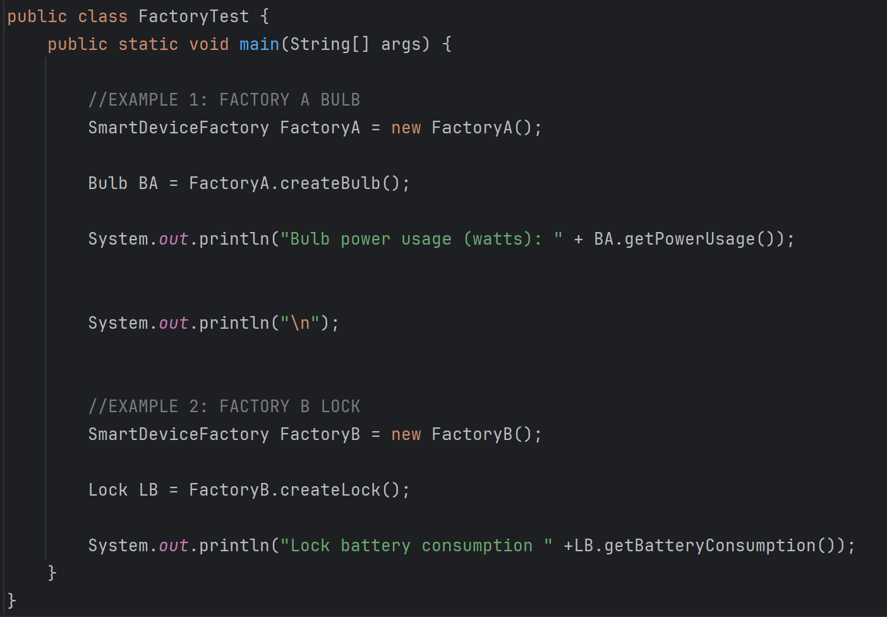
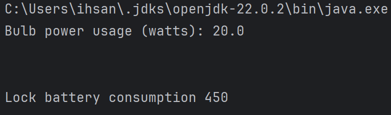

# Software Design & Architecture - Assignment 1

## Description

Group Members: Ihsan Ismail, Khalid Badri, 

## Structure

The general structure of this project is divided into the source folder for the classes and interface, the test folder that holds the test driver, and the README file for codebase information.  

## Test Methods

We used a test driver class which contained main. The start of the test consists of making two new factories with the SmartDeviceFactory interface. Then two objects are created, a bulb from factory A and a lock from factory B. To test the interfaces creation of the correct objects we print out the power usage and battery consumption for the bulb and lock respectively. The bulb came from factory A which should yield a value of 20.0 (float) and the lock came from factory B which should yield a value of 450 (int). Below is a screen dump confirming that this test was succesful.

