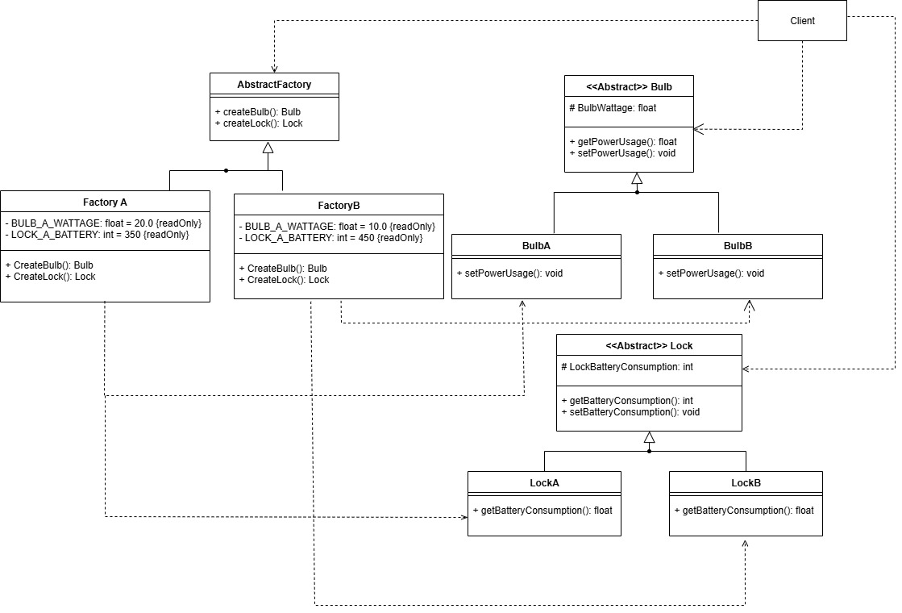
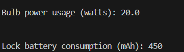

# Software Design & Architecture - Assignment 1

**Tutorial Group:** 18  
**Group Members:** Ihsan Ismail (100915443), Khalid Badri (100917156), Titobi Odufuye (100928489)

## Structure

The general structure of this project is divided into the source folder for the classes (src), the test folder that holds the test driver (test), the image folder which contains all images (imgs) and the README file for codebase information.  

**For an overview of the java class structure please refer to UML diagram:**

## Test Methods

We used a test driver class titled [FactoryTest.java](test/FactoryTest.java) to test our Abstract Factory implementation. The start of the test consists of making two new factories with the SmartDeviceFactory interface. Then, using the factory method, two objects are created: a bulb from factory A and a lock from factory B. After executing the test with no errors, the FactoryTest confirms the object creation portion to be working. Next to test that the factory method pattern instantantiates objects correctly, the getter methods for the power usage and battery consumption for the bulb and lock are called. Both factories are provided setter values to simulate setting the device values from an external database. The bulb from factory A yields a value of 20.0 (float) and the lock which came from factory B yields a value of 450 (int). These values match the sample values given to Factory A and Factory B confirming the test was successful. Below is a screen dump confirming that this test was succesful.

[Here is a link to the test file](test/FactoryTest.java)

**Terminal Output:** 

